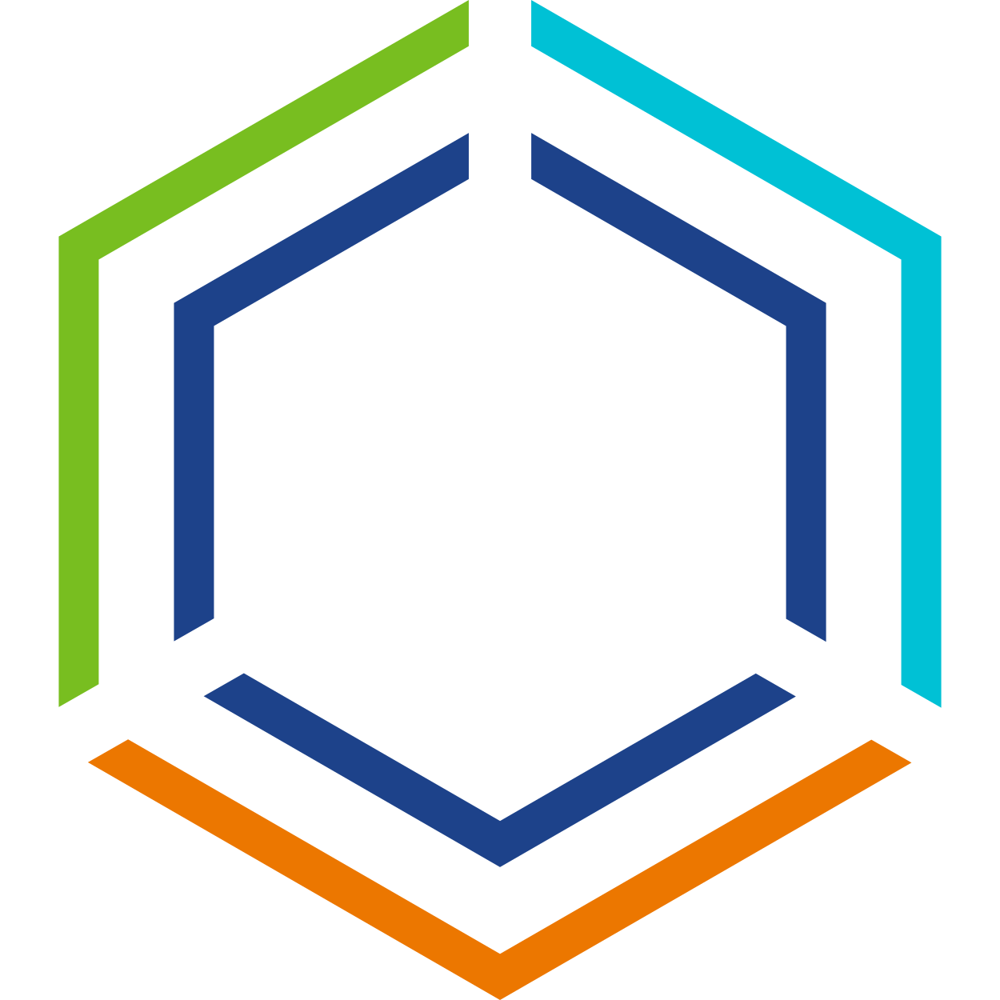
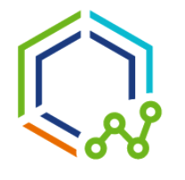
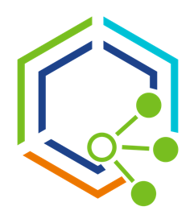

Find Developer and DevOps Resources for omnissa Technology Platforms. APIs, SDKs, docs, code samples, tools, workshops, and other resources to help developers and DevOps teams design, develop, and certify solutions for omnissa products and platforms.

- <figure markdown="span">
    { width="64" }
    <caption>**[Workspace ONE](ws1/index.md)**</caption>
    </figure>
  
    Securely Integrate Your Mobile Apps with VMware Workspace ONE

- <figure markdown="span">
    { width="64" }
    <caption>**[Workspace ONE Intelligence](ws1-intel/index.md)**</caption>
    </figure>
  
    Capture real-time event data from key user flows in your app

## Product Documentation

Links to Official Product Documentation Getting Started Guides are below. The main documentation site can be found at [https://docs.omnissa.com/](https://docs.omnissa.com/).

- 

    ---

    Multi-platform endpoint and app management

    [:octicons-arrow-right-24: Reference](https://docs.omnissa.com/category/workspaceone_uem_getting_started)
- 

    ---

    Focus on your content and generate a responsive and searchable static site

    [:octicons-arrow-right-24: Reference](https://docs.omnissa.com/category/Workspace_ONE_Access_Cloud)

- 

    ---

    Focus on your content and generate a responsive and searchable static site

    [:octicons-arrow-right-24: Reference](https://docs.omnissa.com/bundle/WS1Intelligence/page/IntelMainIntro.html)

- 

    ---

    Securely discover, access, and connect to your company’s resources, teams, and workflows

    [:octicons-arrow-right-24: Reference](https://docs.omnissa.com/bundle/workspace-one-hub-services/page/SettingUpHubServicestoSupportWorkspaceONEIntelligentHub.html)

- 

    ---

    Remote support for digital employees

    [:octicons-arrow-right-24: Reference](https://docs.omnissa.com/bundle/Workspace-ONE-AssistV24.03/page/WorkspaceONEAssist.html)

- 

    ---

    Securely provide either Per-App or Full Device VPN capabilities across all your employees’ devices and delivered with a modern Zero Trust architecture

    [:octicons-arrow-right-24: Reference](https://docs.omnissa.com/bundle/Workspace_ONE_TunnelVSaas/page/TunnelOverview.html)

- 

    ---

    Secure external access to your applications and desktops.

    [:octicons-arrow-right-24: Reference](https://docs.omnissa.com/bundle/UnifiedAccessGatewayDeployandConfigureV2312/page/Deployingandconfiguring.html)

- 

    ---

    Secure virtual desktop (VDI) and app platform delivery

    [:octicons-arrow-right-24: Reference](https://docs.omnissa.com/category/Horizon_8)

- 

    ---

    real-time application delivery system that enterprises can use to dynamically deliver and manage applications.

    [:octicons-arrow-right-24: Reference](https://docs.omnissa.com/bundle/AppVolumesInstallGuideV2312/page/AboutThisBook.html)

- 

    ---

    profile management through dynamic policy configuration

    [:octicons-arrow-right-24: Reference](https://docs.omnissa.com/bundle/DEMInstallConfigGuideV2312/page/AboutInstallingandConfiguringDynamicEnvironmentManager.html)

