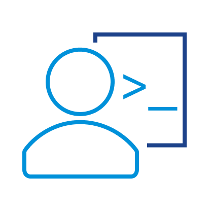

    </img>

The omnissa Developer Portal is a collection of resources and samples that developers, customers and partners can use to integrate and extend their omnissa products.

Developer \{code\} Portal is a free developer program that provides access to a growing community of developers and experts. 
<!-- Follow @omnissacode on Twitter to keep up with omnissa developer topics. -->

<!-- Resources are provided using the links below. -->

## Featured Resources for Developers

- <figure markdown="span">
    { width="64" }
    <caption>**[APIs](apis/index.md)**</caption>
    </figure> 
    
    Build on omnissa products, manage & automate using APIs

- <figure markdown="span">
    { width="64" }
    <caption>**[Developer Centre](dev-centre/index.md)**</caption>
    </figure> 

    Learn, Code and Connect using the Developer Centre as a Base

- <figure markdown="span">
    { width="64" }
    <caption>**[PowerCLI](powerCLI/index.md)**</caption>
    </figure> 

    Use PowerShell to manage & automate Horizon

- <figure markdown="span">
    { width="64" }
    <caption>**[Code Samples](samples/index.md)**</caption>
    </figure> 
    
    Find and share code samples for Workspace ONE and Horizon management, including SDKs, tools and utilities, applications, scripts and sensors

- <figure markdown="span">
    { width="64" }
    <caption>**[SDKs](sdks/index.md)**</caption>
    </figure> 

    Link to the freely available SDKs available for omnissa products

